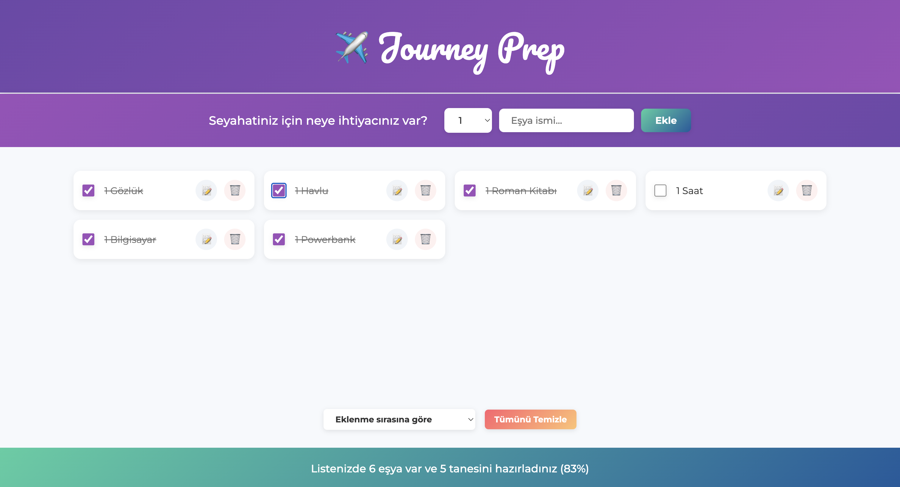

# Journey Prep - Seyahat Hazırlık Listesi Uygulaması

Journey Prep, kullanıcıların seyahat hazırlıklarını kolayca yönetebileceği modern bir React uygulamasıdır. Eşyalarınızı ekleyebilir, hazırlanma durumlarını takip edebilir ve listenizi düzenleyebilirsiniz.

## Özellikler

- 🧳 Eşya ekleme ve silme
- ✅ Hazırlanma durumunu işaretleme
- 📝 Eşya isimlerini düzenleme
- 🔍 Eşyaları sıralama seçenekleri:
  - Eklenme sırasına göre
  - İsme göre alfabetik
  - Hazırlanma durumuna göre
- 📊 İstatistikler paneli
- 🗑️ Tüm listeyi temizleme
- 📱 Tamamen responsive tasarım

## Teknolojiler

- ⚛️ React 18
- 🎨 CSS3 (Modern gradientler ve animasyonlar)
- 📦 Create React App
- 🌐 Vercel Deployment

## Kullanım

1. "Seyahatiniz için neye ihtiyacınız var?" alanına eşya ismini girin.
2. Miktar seçin ve "Ekle" butonuna tıklayın.
3. Eşyalarınızı hazırladıkça checkbox'ı işaretleyin.
4. İstatistikler panelinden genel durumu takip edin.
5. Sıralama seçenekleriyle listenizi düzenleyin.
